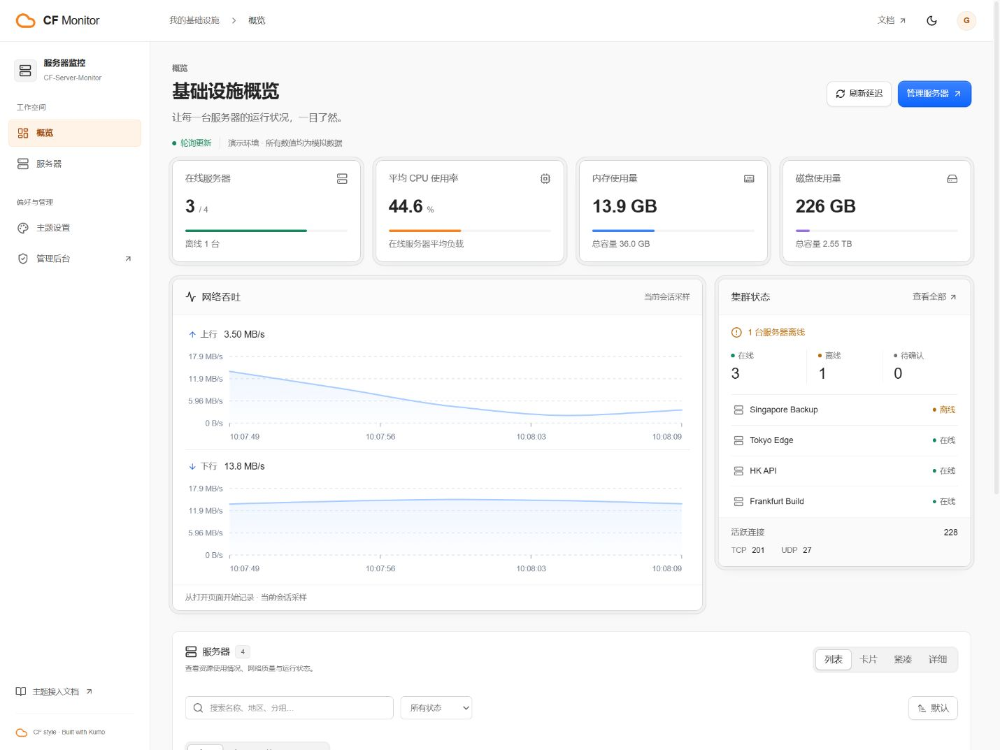
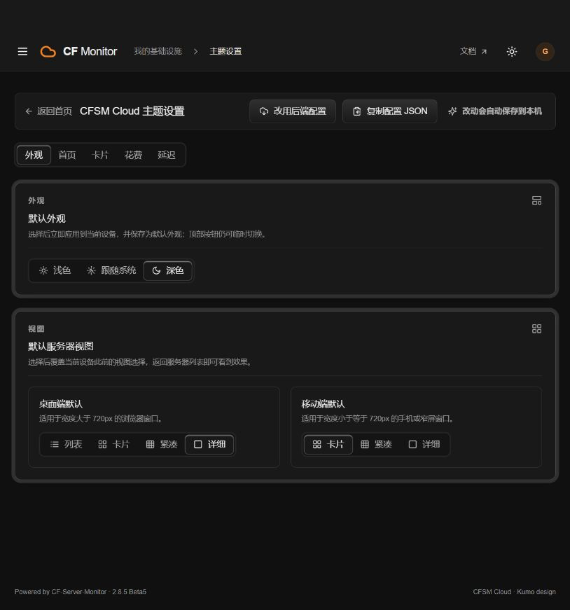

# CFSM Cloud

**为 CF-Server-Monitor 打造的 Cloudflare 控制台风格主题。**

[](https://github.com/SakuraForgot/CF-CFSM/actions/workflows/build-theme.yml)
[](LICENSE)
[](https://react.dev/)
[](https://github.com/cloudflare/kumo)

CFSM Cloud（仓库名 **CF-CFSM**）基于 [CFSM-SAO](https://github.com/WAOR/CFSM-SAO) 的前端与数据适配层，使用 [Cloudflare Kumo](https://github.com/cloudflare/kumo) 重新设计监控界面。以清晰的信息层级、统一的分段控件和克制的交互动画，呈现服务器资源、网络质量与运行状态。

这是社区项目，与 Cloudflare 无隶属或官方合作关系。需要搭配 [CF-Server-Monitor](https://github.com/huilang-me/CF-Server-Monitor) 使用，主题本身不包含 Worker 后端或 Agent。

[快速安装](#快速安装) · [主题设置](#主题设置) · [独立部署与多后端](#独立部署与多后端) · [本地开发](#本地开发) · [更新记录](CHANGELOG.md)

## 界面预览

浅色基础设施概览：资源用量、网络吞吐和集群状态集中展示。



<details>
<summary>查看深色主题设置</summary>



</details>

预览使用本地模拟数据，不代表真实服务器或生产监控结果。

## 功能

| 模块 | 功能 |
| --- | --- |
| 基础设施概览 | 在线状态、CPU / 内存 / 磁盘用量、网络吞吐、集群节点与连接数 |
| 服务器列表 | 列表、卡片、紧凑、详细四种视图；搜索、分组、地区、在线状态与排序 |
| 服务器详情 | 系统与资源信息、负载历史、Ping 历史、多线路延迟与丢包 |
| 外观与交互 | 浅色 / 深色 / 跟随系统、双层半透明卡片边框、悬浮反馈、分段切换、减少动态效果支持 |
| 移动端 | 抽屉导航，卡片 / 紧凑 / 详细视图，独立的默认视图设置 |
| 费用统计 | 资产汇总、计费周期、续费提醒、汇率换算、收购溢价与折价记录 |
| 数据接入 | 同源 Worker、独立静态站、多个标准 CFSM 后端聚合、WebSocket 与轮询降级 |

首页网络吞吐从打开页面后开始积累当前会话采样；负载和 Ping 历史来自后端。生产构建不包含开发模拟数据。

## 快速安装

### 在 CFSM 后台安装（推荐）

1. 打开 CF-Server-Monitor 管理后台，进入主题管理。
2. 在「自定义主题 URL」中填写以下地址，并按后台提示安装、启用：

   ```text
   https://github.com/SakuraForgot/CF-CFSM/tree/dist
   ```

3. 返回监控首页，刷新页面确认主题已加载。

同源安装通常无需配置 API 地址。主题使用宿主 API，管理入口指向宿主的 `/admin#admin`，不会替换管理后台。站点标题、图标、背景和 CSP 仍由宿主按主题协议注入。

**安装地址必须指向构建产物。** `main` 是源码，`dist` 才是可安装主题；不要填写 `.git` 地址、源码分支或单独的 raw `index.html` 地址。

### 更新与固定版本

`main` 推送后，GitHub Actions 会执行检查并把 `index.html` 与 `assets/` 发布到 `dist`。更新前可查看 [构建状态](https://github.com/SakuraForgot/CF-CFSM/actions/workflows/build-theme.yml) 和 [更新记录](CHANGELOG.md)，然后在 CFSM 后台按其更新流程操作；推送仓库不代表已安装的 Worker 自动更新。

需要固定版本或回退时，从 [dist 提交历史](https://github.com/SakuraForgot/CF-CFSM/commits/dist/) 选择对应产物的完整 40 位提交 SHA，将安装地址末尾的 `dist` 替换为该 SHA。请使用 **产物分支的 SHA**，不是源码提交 SHA。

## 主题设置

设置页只保留与当前界面实际相关的选项：

- **外观**：浅色、深色、跟随系统，以及桌面端和移动端默认视图。选择后立即应用到当前设备；视图效果可在服务器列表查看。
- **首页**：总览、分组与地区筛选、排序、分组顺序、隐藏节点和管理员昵称。
- **卡片**：分组、价格、流量、运行时间、计费与连接数等字段。
- **花费**：资产入口、访客价格展示、续费提醒、汇率接口、忽略节点、收购溢价与折价。
- **延迟**：单线路、多线路槽位，以及逐节点线路绑定。

外观保持统一的 CF 风格，不提供旧 SAO 的背景播放器、取色器、透明度、评级标签或悬浮工具。这些旧选项不会随新配置导出；宿主自身的外观注入仍保留。

### 设置保存在哪里？

| 使用场景 | 保存方式 |
| --- | --- |
| 未登录访客 | 自动保存到当前浏览器，仅影响本机 |
| 同源、已登录且具备权限的站长 | 先保存本机，再通过 `/api/theme_options` 同步站点配置；以页面同步结果为准 |
| 手动迁移配置 | 使用「复制配置 JSON」，粘贴到 CFSM 后台「外观设置 → 主题自定义配置」 |
| 恢复站点配置 | 「改用后端配置」放弃本机设置，并恢复后端当前配置 |

已保存的本机配置会参与页面初始化。设置页主动选择外观或视图时，会替换当前设备此前的快捷切换偏好；桌面和手机视图分别保存。

隐藏节点、隐藏价格等选项控制的是前端展示，**不能代替后端的数据访问控制**。

## 独立部署与多后端

### 独立静态部署

适合将展示页面放在独立域名或静态托管服务上。完成下方本地开发中的依赖安装后，复制 `.env.example` 为 `.env`：

```dotenv
API_BASE=https://monitor.example.com
TITLE=我的基础设施
```

运行 `npm run build:github-page`，将生成的 `dist/` 目录部署到静态托管服务。在对应 Worker 的 `CORS_ALLOWED_ORIGINS` 中允许静态站的 origin，例如 `https://status.example.com`，不包含路径或结尾 `/`。

`build:github-page` 是独立静态站的配置注入脚本，也可用于其他静态平台。普通宿主主题构建使用 `npm run build`。

| 变量 | 用途 |
| --- | --- |
| `API_BASE` | 独立部署必填；一个或多个 CFSM 后端地址，多地址用英文逗号分隔 |
| `TITLE` | 可选，静态页面标题 |
| `BACKGROUND_IMAGE` | 可选，静态页面背景注入 |
| `CSP_API` | 可选，额外 API origin 白名单，逗号分隔 |
| `CSP_STATIC` | 可选，额外静态资源 origin 白名单，逗号分隔 |

构建脚本会添加后端 HTTP / WebSocket 与图标来源。托管平台的 CSP 响应头如有额外限制，仍需要在平台侧调整。

### 多个 CFSM Worker 聚合

```dotenv
API_BASE=https://a.example.com,https://b.example.com
```

- 宿主安装：在承载主题页面的 Worker 中设置 `API_BASE`，由宿主注入。
- 独立部署：在构建使用的 `.env` 中设置 `API_BASE`。
- 每个跨域 Worker 都需要允许主题 origin 的 CORS。
- 第一站提供页面配置、管理入口和主题设置；列表合并多个后端，历史请求和实时订阅按节点归属发送。
- 节点 ID 必须全局唯一；重复 ID 以第一站为准。

这里的“复合接口”指多个 **标准 CFSM Worker** 的聚合，不支持任意第三方网关响应格式。

**推荐仅聚合公开后端。** 当前 JWT / Turnstile 凭证只有一套，携带凭证的请求可能将同一凭证发送给配置的多个后端；不支持多个私有站点独立登录或分别验证。不要将不可信后端加入使用了登录或验证凭证的聚合配置。私有监控优先使用同源单站。

独立静态站与 Worker 后台的浏览器存储不共享；在 Worker 后台登录不会自动让静态站获得管理员登录态。本主题没有独立跨域登录流程。

## 安全与接入边界

- 主题不提供 WebSSH、远程命令下发或 Agent 主控通道；Agent 与 Worker 的权限由源项目负责。
- 主题不是完全只读：具备权限的站长可保存主题配置。实际写入权限由 Worker 校验。
- 自定义主题在站点页面中执行，应像站点自身代码一样信任。请使用可信仓库，必要时固定产物 SHA。
- 不要在 `.env`、主题配置或公开仓库里放入 `API_SECRET`、管理员密码等服务端秘密；前端构建内容对访问者可见。

接口适配依据与已知限制见 [接入审核](docs/compatibility.md)。现有验证包含协议测试、构建检查和本地模拟交互；不代表对所有 CFSM 版本或生产 Worker 完成验收。目标站的登录、Turnstile、CORS 和 Agent 实时上报仍需在实际部署中确认。

## 本地开发

使用 Node.js **22.12+**（CI 使用 Node 22）和 npm。

```sh
git clone https://github.com/SakuraForgot/CF-CFSM.git
cd CF-CFSM
npm ci
npm run dev -- --host 127.0.0.1
```

打开 [本地演示](http://127.0.0.1:5173/?mock=1)，即可使用模拟服务器检查界面，无需部署 Worker。`mock=1` 仅在开发模式生效。

连接真实后端时，在 `.env` 填写 `API_BASE`，重启开发服务，移除 URL 中的 `mock=1`，并在后端允许 `http://127.0.0.1:5173` 的 CORS。

| 命令 | 作用 |
| --- | --- |
| `npm run dev` | 启动 Vite 开发服务 |
| `npm run typecheck` | TypeScript 类型检查 |
| `npm run lint` | ESLint 检查 |
| `npm test` | 运行自动化测试 |
| `npm run build` | 生成 CFSM 宿主主题产物 |
| `npm run verify:dist` | 检查产物目录、资源引用、主题版本和 mock 隔离 |
| `npm run build:github-page` | 构建独立静态站并注入环境配置 |

项目使用 React 19、TypeScript、Vite、Kumo、TanStack Query 和 uPlot。图标由宿主 `/flags/`、`/os-icons/` 提供，开发图标不会打包进生产主题。

`.npmrc` 中保留了 `legacy-peer-deps=true`：当前校验层使用 Zod 3，而 Kumo 可选表单模块声明 Zod 4；本项目未使用该表单模块。安装请使用仓库中的锁文件和配置。

## 常见问题

**安装后仍然是旧界面？**

确认使用 `dist` 安装地址、对应 Actions 已成功，并在后台完成主题更新。固定 SHA 的安装不会跟随 `dist` 变化；必要时刷新浏览器缓存。

**页面有框架，但没有服务器数据？**

检查 `API_BASE`、Worker 可用性以及跨域 CORS。401 / 403 通常需要检查登录或验证状态。不要用 `mock=1` 判断真实后端是否接通。

**为什么没有国旗或系统图标？**

图标来自后端，检查 `/flags/`、`/os-icons/` 是否可访问，以及托管平台的 CSP 是否允许该来源。

**为什么网络吞吐图刚打开没有历史？**

首页吞吐展示当前页面会话收到的采样，需要等待新数据积累；后端历史在服务器详情的负载 / Ping 页面查看。

**设置只在一台设备生效？**

访客设置保存在本机。需要全站默认值时，使用已认证站长的同步功能，或将导出的 JSON 写入后端主题配置；查看页面保存状态确认结果。

## 参与贡献

欢迎通过 [Issues](https://github.com/SakuraForgot/CF-CFSM/issues) 报告问题或提出建议，通过 [Pull Requests](https://github.com/SakuraForgot/CF-CFSM/pulls) 提交改进。

报告问题时请附上主题版本或产物 SHA、CFSM 版本、浏览器、安装方式、复现步骤及预期结果。截图和日志请移除 token、Cookie、密码和其他敏感信息。疑似安全漏洞请勿公开可直接利用的细节或真实凭证。

提交代码前运行 `npm run lint`、`npm test`、`npm run build` 和 `npm run verify:dist`。涉及交互时，请实际操作并验证刷新、重新进入页面和移动端表现。新增功能应适配浅深色，并保留减少动态效果的行为。

PR 提交源码即可，不要提交 `.env`、`node_modules/` 或本地 `dist/`；构建产物由 Actions 发布。`main` 对应 `dist`，`preview` 对应 `dist-preview`。

## 致谢与许可

感谢 [CF-Server-Monitor](https://github.com/huilang-me/CF-Server-Monitor)、[CFSM-SAO](https://github.com/WAOR/CFSM-SAO)、[Cloudflare Kumo](https://github.com/cloudflare/kumo) 及相关上游项目。

本项目新增及修改代码以 [MIT License](LICENSE) 发布。继承代码及第三方资源保留原作者归属和适用许可，详见 [第三方许可说明](THIRD_PARTY_NOTICES.md)；构建产物另附 `assets/THIRD_PARTY_LICENSES.txt`。
